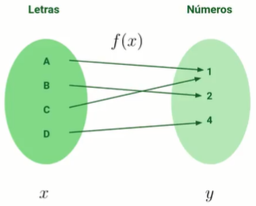

# FUNCIONES MATEMÁTICAS PARA DS Y IA

[Version en notion](https://www.notion.so/FUNCIONES-MATEM-TICAS-PARA-DS-Y-IA-c136bb2787404d8baef39f336fd71619) 

## INTRODUCCIÓN

Las matemáticas son un lenguaje más. Las matemáticas son un lenguaje que nos permite expresar nuestras ideas de manera exacta.

### ¿Qué es una función?

Una función es como una máquina: entra un elemento X (variable independiente) y sale un elemento Y (variable dependiente). En el caso de una variable. $y = f(x)$

Las funciones nos permiten modelar nuestra realidad.

Vamos a obtener un valor que va a variar de otros factores. En el curso vamos a ver funciones de una sola variable, es decir que el valor que vamos a obtener va a variar o depender de una sola cosa.

Una función es una regla donde a cada elemento de un conjunto A se le asigna un elemento de un conjunto B. Se puede representar como este diagrama. 



Recordemos que los valores de X solo pueden tener asignado un valor de Y, y el mismo valor de Y puede ser asignado a diferentes valores de X.

### Formas de representar una función

- Verbalmente. Por ejemplo:
    - “A cada letra del abecedario se le asigna un número entero diferente”.
    - “El precio aumenta en 2 dólares por cada kilómetro recorrido”.
- Numéricamente. Por ejemplo:
    - Una tabla de valores
        
        
        
- Visualmente. Por ejemplo:
    - Gráfica de una parábola
    
    
    
    Podemos ver que una función no es una función si trazamos una línea vertical en la gráfica y toca más de un punto de la variable dependiente (x)
    
- Algebraicamente. Por ejemplo:
    - $y = f(x) = x^2$

### Tipos de variables

Normalmente las variables se clasifican en dos grandes grupos:

- Variables cualitativas
    - Nominales: asignamos una cualidad. Por ejemplo, los colores.
    - Ordinales: representan un orden. Por ejemplo, alto, medio y bajo.
    - Binarias: solo toman dos valores, usualmente usadas para representar estados. Son muy útiles para procesos de Machine learning o clasificación
- Variables cuantitativas
    - Discretas: finitas y toman ciertos valores. Pueden verse como variables separadas por un “paso” (no hay valores intermedios).
    - Continuas: Sus valores pueden verse como infinitos al tomar cualquier valor dentro de los números reales en un rango establecido.


Lo que solemos modelar para escribir funciones se encuentran normalmente en el grupo de las variables cuantitativas porque hacemos una generalización mucho más grande.

### Dominio y rango de una función

Su definición nace de la pregunta: ¿Qué valores pueden tener las funciones?.

- Dominio: son los valores que toma X y que están definidos en la función f(x)
- Rango: son todos los resultados que nos puede dar una función.

Relacionando, en una cafetería el dominio son los granos de café, la función es nuestra cafetera y el rango son todas las clases de café que podemos preparar.

## CÓMO LEER MATEMÁTICAS

### símbolos generales

- Símbolos de igualdad o relación
    - “=”
    - “>”, “≥” y “>>” mucho mayor a
    - “<”, “≤” y “<<” mucho menor a
    - Diferente de
    - Aproximadamente
- Símbolos de operaciones acumulativas:
    - Sumatoria
        
        
        
    - Producto
        
        
        


### Conjuntos

- Universal: **Ω**
- (O) Unión: **∪**
- (Y) Intersección: **∩**
- Pertenece: **∈**
- No pertenece: ∉
- Conjunto vacío: **∅** o también podemos encontrarlo como 2 llaves vacías **({})**
- Un elemento de un conjunto se escribe en minúscula y los conjuntos tienden a escribirse con mayúscula. Por ejemplo, $a ∈ A$

### Conjuntos de números

- | = tal qué
- N=Numeros naturales: {1,2,3,4,…|n≠0}
- Z= números enteros: {…,-2,-1,0,1,2,…}
- Q= Números racionales:{a/b | a,b∈Z , b≠0}
    - “a/b” tal qué "a"y “b” pertenencen a los números enteros y a su vez “b” es distinto que cero.
- I= números irracionales, por ejemplo: {π, e, raiz cuadrada}
- R= Números reales: {N **∪** Z **∪** Q **∪** I} Unión de todos los números detallados anteriormente
    - R+: todos los números reales positivos
    - R-: todos los números reales negativos

### Función/Aplicación

f: X -> Y = Función X se vuelve a Y

f: R→ R+ =f(x)=abs(x)=|x| :Una función que traslada los números reales a números reales positivos (valor Absoluto).


La forma en la que las computadoras procesan los datos son discretos.

## FUNCIONES ALGEBRÁICAS

Google colab con toda la información necesaria: [Aquí](https://colab.research.google.com/drive/1El3FgiMicjVXqt5OlmTkYPT42svORnJg#scrollTo=_eH8kVUMMmkK)

Liberías a importar:

```python
import matplotlib.pyplot as plt   # librería para graficar
import numpy as np                # librería para manejo de vectores y utilidades matemáticas
```

### Función lineal

Tiene la forma de $f(x) = mx + b$ donde m y b ∈R

m es la pendiente y puede ser calculada por: $m=y2−y1/x2−x1$ y b es el punto de corte con el eje y. Su dominio es Domf=(−∞,∞). Su imagen es Imf=(−∞,∞).

Cómo definir la función en código:

```python
N = 100
m=10
b=5
def f(x):
	return m*x+b

x=np.linspace(D1,D2, num=N) #D1 y D2 es el dominio de la función con N valores
y=f(x)
fig, ax = plt.subplots() #Para crear el espacio
ax.plot(x,y) #gráfica
```

### Función polinómica

Tiene la forma de 


y es llamado polinomio de grado n y a es un coeficiente donde $a∈R$.

Hay unas funciones que son un caso particular de las funciones polinómicas que son las funciones potencia, las cuales tienen la forma:


Pasamos al código:

```python
N=100
def f(x):
	return (2*x**7)-(x**4)-(3*x**2)+4
x=np.linspace(D1,D2, num=N)
y = f(x)
plt.plot(x,y)
plt.grid() #Para que se vea con cuadrícula.
```

## FUNCIONES TRASCENDENTES

Son funciones que no pueden ser expresadas con polinomios.

### Funciones trigonométricas

Algunos ejemplos son las funciones $sen(x)$, $cos(x)$ y $tan(x)$

```python
def f(x):
	return np.sin(x)

y = f(x)
plt.plot(x,y)
```

### Función exponencial

Tienen la forma de $f(x) = a^x$ donde a es una constante positiva.

```python
N=100
def f(x):
	return np.exp(x)
x=np.linspace(D1,D2, num=N)
y=f(x)
plt.plot(x,y)
```

### Función logaritmo

El logaritmo está definido por la relación 


donde:

- b  es la base.
- n  es el exponente al que está elevado la base.
- x  es el resultado de elevar la base  b  al exponente  n. X debe ser mayor a cero.

```python
def f(x):
	return np.log2(x)

x = np.linspace(D1,D2,N) #donde D1 va a ser mayor a 0
#Entre más alto sea N, más "suave" se verá la gráfica
plt.plot(x,y)
```

## FUNCIONES SECCIONADAS

Son funciones que tienen diferentes valores definidos por un intervalo. Por ejemplo la función escalón de Heaviside:


```python
def H(x):
  Y = np.zeros(len(x))
  for idx,x in enumerate(x): #enumerate es una función que nos permite obtener
														#el indice y el elemento de un arreglo en Python
    if x>=0:
      Y[idx]=1
  return Y

N=1000

x = np.linspace(-10,10, num=N)

y = H(x)

plt.plot(x,y)
```


Ejemplo: función de valor absoluto:

```python
import matplotlib.pyplot as plt  
import numpy as np
def f(x):
  return np.absolute(x)

N=1000
x = np.linspace(-100,100, num=N)
plt.plot(x,f(x))
```


## FUNCIONES COMPUESTAS


Conocidas las funciones f y g, la composición de f y g está dada por:

$$
FoG=(FoG)(x)=F(g(x))
$$

```python
import numpy as np
import matplotlib.pyplot as plt

N=1000
x=np.linspace(-10,10,num=N)

def g(x):
	return x**2

def f(x):
	return np.sin(x)

y=f(g(x))
plt.plot(x,y)
```


# CÓMO MANIPULAR FUNCIONES

Primero tenemos que poner las dependencias:

```python
import numpy as np
import matplotlib.pyplot as plt
```

### Desplazamientos verticales y horizontales

Siendo  c  una constante mayor que cero, entonces la gráfica:

- $y=f(x)+c$  se desplaza  c  unidades hacia arriba.
- $y=f(x)−c$  se desplaza  c  unidades hacia abajo.
- $y=f(x−c)$  se desplaza  c  unidades hacia la derecha.
- $y=f(x+c)$  se desplaza  c  unidades hacia la izquierda.

### Alargamientos y compresiones

Siendo  c  una constante mayor que cero, entonces la gráfica:

- $y=c*f(x)$  alarga la gráfica verticalmente en un factor de  c .
- $y=(1/c)*f(x)$  comprime la gráfica verticalmente en un factor de  c .
- $y=f(c*x)$  comprime la gráfica horizontelmente en un factor de  c .
- $y=f((1/c)*x)$  alarga la gráfica horizontelmente en un factor de  c .

### Reflexiones

- $y=−f(x)$ refleja la gráfica respecto al eje x.
- $y=f(−x)$ refleja la gráfica respecto al eje y.

## CARACTERÍSTICAS DE LAS FUNCIONES

Se les llama funciones reales porque tanto su dominio como el codominio (recuerda que al codominio también se le puede llamar rango o imagen) están contenidos en el conjunto de los números reales. Es decir, el conjunto que contiene a los números racionales e irracionales.

### Función par e impar (simetría)

Recordemos que si n es par, va a tener una simetría con respecto al eje y (por ejemplo, una parábola),  es decir, si cumple esta relación a lo largo de su dominio:

$$
f(-x) = f(x)
$$

Si n es impar va a tener simetría con respecto al origen (por ejemplo, una función cúbica), es decir, si cumple esta relación a lo largo de su dominio:

$$
f(-x) = -f(x)
$$

### Función acotada

Una función es acotada si su codominio (también conocido como rango o imagen) se encuentra entre dos valores, es decir, está acotado. Esta definición se define como que hay un número m que para todo valor del dominio de la función se cumple que:

$$
-m<= f(x) <= m
$$

Por ejemplo, la función seno o coseno están acotadas en el intervalo [-1,1] dentro de su co-dominio.

### Funciones monótonas

Son útiles de reconocer o analizar debido a que nos permiten saber si una función crece o decrece en alguno de sus intervalos. Que algo sea monótono significa que no tiene variaciones. Entonces las funciones monótonas son aquellas que dentro de un intervalo I, perteneciente a los números reales, cumple alguna de estas propiedades:

1. La función es monótona y estrictamente creciente:
    
    
    
2. La función es monótona y estrictamente decreciente:
    
    
    
3. La función es monótona y creciente:
    
    
    
4. La función es monótona y decreciente:
    
    
    

### Funciones periódicas

Son aquellas que se repiten cada cierto periodo denominado con la letra T. La relación que debe cumplir la función para ser periódica es la siguiente:

$$
f(x)=f(x+T),T≠0
$$

Por ejemplo las funciones seno y coseno tienen un periodo de T = 2**π**

### Funciones cóncavas y convexas

Se dice que una función dentro de un intervalo es convexa si la función “abre hacia arriba”.


Se dice que una función dentro de un intervalo es concava si la función “abre hacia abajo”.


## PERCEPTRÓN

El perceptrón es la forma en la cual nosotros definimos una neurona artificial.

### La neurona


Lo podemos ver como una función o modelarlo de manera matemática se vería así:


Normalmente las señales de entrada son ceros y unos porque es lo que los modelos de machine learning normalmente están preparados para calcular.

Los pesos sinápticos normalmente son números encargados de ponderar qué tan importante es la señal de entrada.

La parte de la unión sumadora se llama combinación lineal (multiplicar diferentes señales de entrada por un peso y sumarlas completamente); con esto vamos a obtener una línea recta.

Agregamos una especie de filtro que se puede ver como una composición de funciones la cual es una función de activación, es decir, lo que salga de nuestra unión sumadora lo vamos a pasar a través de una función de activación que le va a dar un comportamiento no lineal.

### Red neuronal artificial


Cada bola es un perceptrón y se va a conformar de la parte matemática vista anteriormente, es decir, si unimos las neuronas nos forman una red neuronal.

Si quieres leer más acerca del Perceptrón: [The Perceptron (book)](https://static.platzi.com/media/public/uploads/the-perceptron_ca283e9f-bd76-4564-9309-0a50877d4c35.pdf)


### Funciones de activación

Empezamos importando nuestras dependencias:

```python
import numpy as np
import matplotlib.pyplot as plt

N = 1000
x = np.linspace(-5,5, num=N)
```

algunos tipos de funciones de activación son:

- Función lineal: sirve sobre todo cuando queremos mantener valores a lo largo de un proceso.
- Función escalón o de Heaviside: funcionaría para hacer clasificaciones categóricas (valores binarios), por ejemplo, nos puede indicar si algo está apagado o prendido, existe o no existe,
- Función sigmoide: nos sirve para un proceso llamado regresión logística. También sirve cuando estamos hablando de probabilidades ya que el rango es de 0 a 1.
    
    
    
    ```python
    def f(x):
      return 1/(1 + np.exp(-x))
        
    N=1000
    y = f(x)
    
    plt.plot(x,y)
    plt.grid()
    ```
    
    
    
    - Cuando x=0, y=0,5
    - Cuanto más valga x y sea positiva, mayor es la probabilidad de valer 1, y si x es muy grande de manera negativa, mayor es la probabilidad de valer 0.
- Función tangente hiperbólica: normalmente se conoce como una función de escalamiento porque va a tener valores de -1 a 1 y siguen un proceso similar a la función sigmoide.
    
    
    
    ```python
    def f(x):
      return np.tanh(x)
        
    N=1000
    y = f(x)
    
    plt.plot(x,y)
    plt.grid()
    ```
    
    
    
- Función ReLU: esta función por lo general se pone al final del perceptrón cuando queremos seguir un proceso de simulación de neuronas muertas, es decir, cuando los valores básicamente tienden a ser ceros o negativos.
    
    $$
    R(x)=max(0,x)
    $$
    
    ```python
    def f(x):
      return np.maximum(x,0)
        
    N=1000
    y = f(x)
    
    plt.plot(x,y)
    plt.grid()
    ```
    
    
    

## REGRESIÓN LINEAL SIMPLE

La regresión lineal permite explicar la relación de una variable dependiente (y), con respecto a otras variables independiente (x). Permite explicar como se afecta la variable dependiente por los cambios que tenga la variable independiente. Para su representación se utilizan gráficos de dispersión e histogramas.

### ¿Cómo se calcula un error?

El error nos ayuda a medir que tan equivocada es la relación entre dos resultados.


$$
E=∑(ÿ-y)^2
$$

Esta fórmula solo nos está dando el error total y una forma en la cual podemos saber de manera más exacta qué tanto es el error es sacando el promedio con el error cuadrático promedio (ECM)


Las funciones que dicen qué tanto te equivocas se llaman funciones de coste.